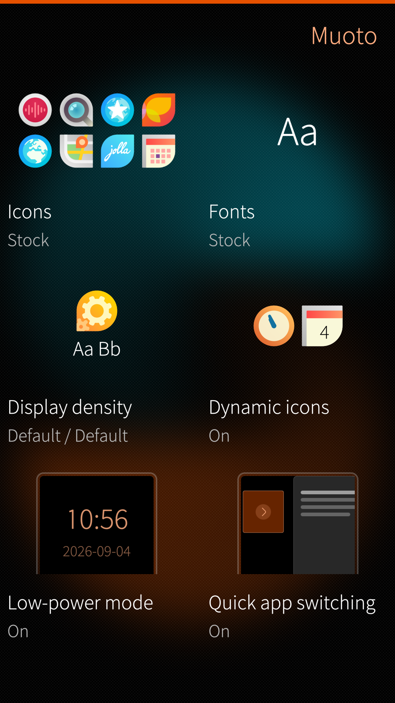
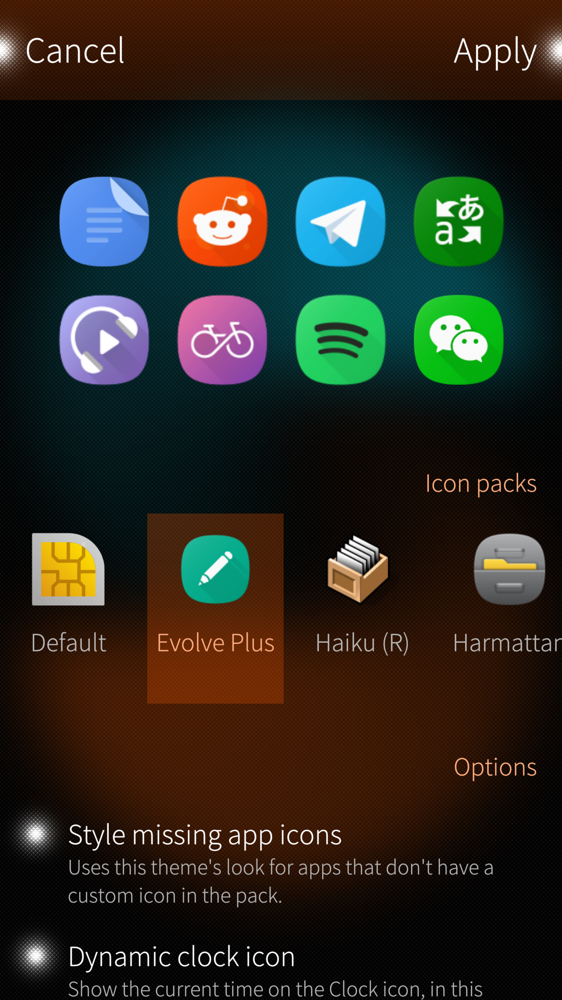
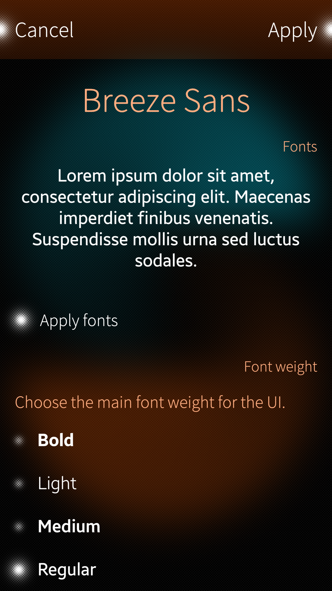
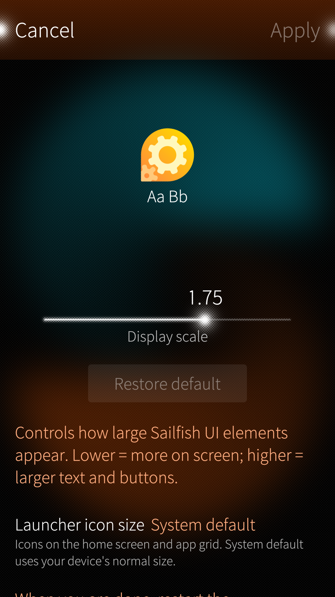
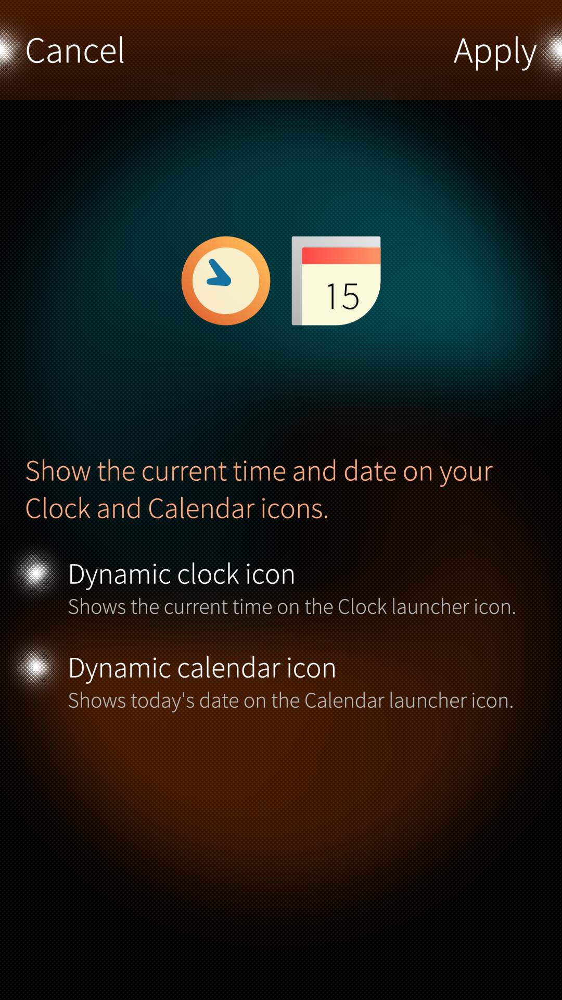
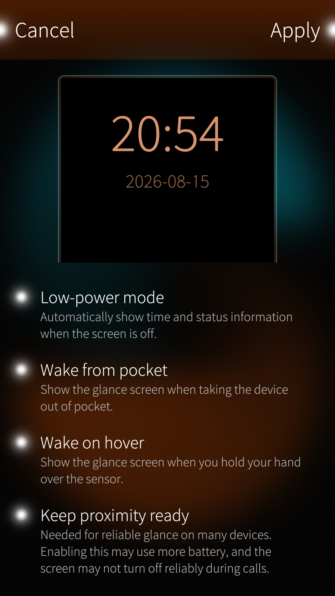

# Muoto

Muoto lets you customize icons, fonts and pixel density in Sailfish OS. It bundles the former **Theme pack support** engine (systemd services, privileged helper, and compatibility with `harbour-themepack-*` packages) in a single app.

   

## Features

   
  
 

- Icon theming (native, Jolla, Android).
- Style missing app icons (theme look for apps not in the pack).
- Dynamic clock and calendar icons on the homescreen.
- Font theming.
- Display density (pixel ratio, launcher icon size).
- Low-power mode settings.
- Quick app switching (hidden Sailfish OS gesture to jump back to the previous app).

## Using Muoto

[Using Muoto](docs/guide.md) — apply themes, display density, restore, and other app features.

## Download theme packs

Download theme packs from [OpenRepos](https://openrepos.net/tags/themepack).

## Create theme packs

[Create theme packs](docs/getstarted.md) — documentation (icons, fonts, packaging with the Sailfish SDK).

## Developers

[Developers](docs/devel/) — architecture, testing, debugging, and auto-apply automation (maintainers and contributors). See also **AGENTS.md** at the repository root for coding-agent orientation.

## Translate

Request a new language or contribute on the [Transifex project page](https://explore.transifex.com/fravaccaro/ui-themer).

## Builds

Builds for aarch64, armv7hl and i486 are available on [OpenRepos](https://openrepos.net/content/fravaccaro/muoto-ui-themer).

## Migration from UI Themer

- Restore your current theme from **UI Themer** (`sailfishos-uithemer`) before swapping packages.
- Uninstall `sailfishos-uithemer`.
- Install `harbour-muoto` (also replaces the merged **Theme pack support** / `harbour-themepacksupport` package).
- Re-apply your preferred theme packs in Muoto.
- App settings are not auto-migrated; re-apply packs if needed after upgrading.

## Credits

- [Opal](https://github.com/Pretty-SFOS/opal) QML modules (About, SupportMe, LinkHandler) by [Mirian Margiani](https://github.com/Pretty-SFOS/opal-about).
- Theme pack support engine by fravaccaro (formerly separate `themepacksupport-sailfishos` package).
- Partially based on [Icon pack support GUI](https://github.com/RikudouSage/sailfish-iconpacksupport-gui).
- Dynamic icons implementation and Lipstick nudge for native apps inspired by [Clockwork](https://github.com/dseight/clockwork) by dseight.
- Thanks to Dax89 for C++ and QML help.
- Thanks to Eugenio_g7 for the *One-click restore* service.
- Thanks to LQS for Android DPI on Xperia XA2.
- Thanks to [dt.iki.fi/sailfish-os-change-default-font](https://dt.iki.fi/sailfish-os-change-default-font).
- Thanks to all testers.

## AI disclosure

- **Human foundation.** Theme pack support and UI Themer — the engine behind icon, font, and density theming on Sailfish OS — were authored, designed, and developed without AI input.
- **Cursor-assisted work.** During the Muoto rename and ongoing maintenance of this repository, [Cursor](https://cursor.com) was used as an IDE with AI assistance for tasks such as documentation updates, code exploration, UI polish, translation cleanup, and RPM packaging tweaks. Output was always reviewed and edited by the maintainer before commit.
- **Not a substitute for testing.** AI suggestions do not replace rigorous testing on Sailfish OS hardware, reading the code, or applying your own knowledge. Generated changes are treated like any other patch: understand it, test it, then ship it.

*Muoto's theming engine is human-built; Cursor helped maintain and polish what wraps it.*
