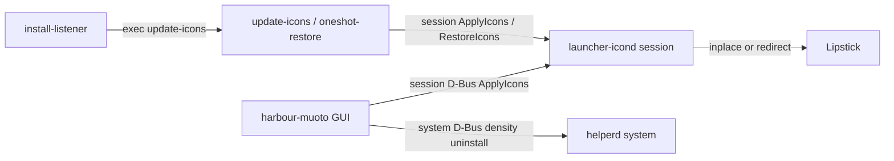

# Architecture

How Muoto theming works at runtime (3.6+). Pack-author layout is documented under [Icon pack guidelines](../icons.md); this page is the engine.

## Processes



| Process | Bus / unit | Role |
| ------- | ---------- | ---- |
| `harbour-muoto` | user GUI | Mosaic home, configure pages, density; calls Helper / Launcher |
| `harbour-muoto-launcher-icond` | session `org.muoto.Launcher1` | All launcher icon apply/restore; `cap_dac_override` for system `.desktop` / silica folder writeback |
| `harbour-muoto-helperd` | system `org.muoto.Muoto1` | On-demand: `DensityEnable`, `UninstallPack` only |
| `harbour-muoto-install-listener` | user unit | D-Bus hooks → `/usr/bin/harbour-muoto-update-icons` |
| Boot / upgrade scripts | root systemd oneshots | Re-apply or pre-upgrade restore — see [Automation](automation.md) |

## Icon apply (launcher daemon)

1. GUI (or `update-icons`) sets dconf `activeIconPack` / `iconOverlay`, then calls session `org.muoto.Launcher1.Themes.ApplyIcons`.
2. `LauncherIconOps` re-arms Lipstick's watches on the APK desktops (see below), rebuilds one `IconUpdater` per launcher `.desktop` (system + user APK desktops), then applies homescreen **folders** via `FolderAmbient`.
3. Pack assets come from `/usr/share/harbour-themepack-<name>/` (`jolla/`, `native/`, `apk/` — often symlinked to `~/.themepack/…`). Overlay frames from `overlay/` composite onto stock when the pack has no matching icon.
4. **Write model (hybrid):**
   - **Hicolor** (native / overlay targets whose stock `Icon=` resolves to a raster hicolor slot): **inplace across every `<N>x<N>/apps/` slot that exists** — keep `Icon=` as the theme name; render the pack icon (or overlay composite) at each slot's size and `FileWrite::inPlace` it (inode preserved); `futimens` the `.desktop`. Never redirect these entries: `LauncherModel::updateItemsWithIcon` pins an item to a concrete hicolor path whenever it processes the entry while `Icon=` is a bare name that exists under a configured icon directory (`LauncherItem::m_customIconFilename`), and a pinned item ignores `Icon=` rewrites until the homescreen restarts. Writing the slot bytes and touching the desktop makes Lipstick re-pin (serial bump) and repaint — self-healing whether the item was pinned or not, which is what makes restore→apply, fresh installs and rpm updates work without a restart. `scalable/apps` SVGs are never written; entries that resolve only to scalable keep redirecting.
   - **APK bridge**: **redirect** — write `/usr/share/harbour-muoto/launcher-icons/<desktop>-<msecs>.png`, set `Icon=` to that path, touch the desktop (absolute paths never pin; a new `Icon=` path is what makes Lipstick refresh).
   - **Jolla apps** (`icon-launcher-*` theme names): **redirect** — those names don't resolve in hicolor, so they cannot pin.
5. Original `Icon=` / paths are tracked in dconf `saved-id`, per-slot fingerprints (inplace), and `launcher-manifest.json` (**one entry per themed slot** for inplace desktops; `LauncherManifest::replaceEntriesForDesktop` swaps a desktop's set atomically).
6. Homescreen **folders** (`icon-launcher-folder-01`…`16`) use scoped silica writeback + `backup/folder-icons/` (`FolderAmbient`).
7. Dynamic clock/calendar use pack `dynclock/` / `dyncal/` (or stock SVG when pack is `default`) when dconf dyn flags are on.

Restore uses the manifest (redirect `Icon=` reverts + per-slot inplace backups), restores folder backups, clears generated `launcher-icons/`, and sets `activeIconPack` to `default`. For hicolor apps `Icon=` is never rewritten, so restore repaints live through the same slot-write + desktop-touch path as apply. On a **failed** slot restore the stored fingerprint is kept: resetting it made the next apply treat our leftover bytes as stock and overwrite the real backup (seen on device — four 86x86 backups ended up holding pack art).

### Serialising operations

Everything that used to call `LauncherIconOps` directly — D-Bus, the dconf watches, the desktop-directory watcher, apkd container readiness, the dynamic-icon tick — now describes what it wants as an `IconJob` and hands it to `IconJobQueue` (`src/launcher/iconjobqueue.cpp`). Kinds are `ApplyAll`, `Restore`, `RefreshDesktops`, `RefreshApk`, `Rebuild` and `RebuildDyn`.

Exactly one job runs at a time and callers never block. The old design ran each operation wherever its trigger fired, so an apply, the desktop watcher and the 60 s dynamic tick could all be part-way through at once; `FileLock` could not arbitrate because they shared a process. That overlap is what let a write land on an entry another operation had renamed aside.

Two details are load-bearing:

- The flock is held **across the whole drain**, not per job. `harbour-muoto-update-icons` and the repair oneshot decide an operation finished by watching that lock, so a per-job lock would let them observe someone else's and report success before their own request ran.
- `beginSelfWrite()` / `endSelfWrite()` mark the dconf writes a job makes itself, so the watches those writes trigger do not enqueue a rebuild of work already in progress.

`enqueue()` returns 0 for a request it can refuse on inspection (a pack that does not exist), rather than making the caller wait out a drain to be told no. Queued-but-not-started is reported via `jobQueued()`, so a caller can tell "waiting behind a drain" from "the daemon died".

The D-Bus contract follows from this. `ApplyIcons` / `RestoreIcons` **reply immediately**, before the work: the caller's pending call completes at once and the connection keeps serving introspection and signals while icons are rewritten. Completion arrives as `OperationCompleted(op, ok, message)`, matched by request id so back-to-back operations cannot latch onto each other's completion. `Progress(op, done, total)` with `(0, 0)` means "queued, not started yet", which the GUI renders as *Waiting…*; it replaced the client-side lock probe, since the daemon knows what is queued and the GUI could only sample a lock and guess.

`OpStatus` (`src/launcher/opstatus.cpp`) records the outcome of each operation — `Ok`, `Partial` (some updaters refused, pack still applied) or `HardFailure` (nothing written) — as a sequence-numbered record in `/usr/share/harbour-muoto/last-op.json`. The shell callers used to infer success from the lock lifecycle, which is how a rejected apply could still be logged as a success, and journald is `Storage=volatile` on device, so without this file a user bug report arrives with no history. The sequence is seeded from the existing file at startup, never from zero: the repair restarts the daemon and then immediately runs `update-icons`, so a counter that rewound would make the caller misread whose result it is reading.

### Re-arming Lipstick's desktop watches

Lipstick's `LauncherMonitor` holds a per-file inotify watch on every `.desktop` it has discovered, and `LauncherModel` only re-reads an entry when that watch fires. apkd regenerates `apkd_launcher_*.desktop` with `rename(2)` whenever the Android container is rebuilt; Qt drops the watch on the replaced inode, and `onDirectoryChanged` only calls `addPaths()` for filenames it has not seen before — so the watch is gone for good. Measured on device, all 15 APK desktops were unwatched while all 76 system ones were fine. From then on the `Icon=` redirect is invisible and the tiles need a homescreen restart.

`LauncherRearm` (`src/launcher/launcherwatch.cpp`) fixes this by renaming each entry to `<name>.muoto-rearm` and back, batched across all APK desktops:

- The two renames land in **separate** directory scans (`kSettleMs`, 400 ms apart), so Lipstick actually observes the name leaving and returning and calls `addPaths()` again.
- Both scans fall inside the 2000 ms `LAUNCHER_MONITOR_HOLDBACK_TIMEOUT_MS` window, so the pending remove and add cancel out and no launcher item is rebuilt — grid positions in `[LauncherOrder]` are untouched.
- `rename(2)` keeps the inode, owner, mode and contents, so nothing else about the entry changes.
- Callers then sit out the holdback (`kHoldbackMs`, 2400 ms) before rewriting `Icon=`, and resume on `finished()`.

The sequence is a **single-shot timer state machine**, not a nested `QEventLoop`. Nested loops are what used to make the daemon re-entrant: a D-Bus call, the desktop-directory watcher or the 60 s dynamic tick could run *inside* a re-arm, while entries were renamed aside, and a write to an entry that was not there produced a stub. `startHoldbackOnly()` covers callers that only need the grid to settle.

`applyIcons()` and `restoreIcons()` both re-arm up front (`rearmThen()`) — restore rewrites `Icon=` too and needs a live watch just as much. Leftovers are swept two ways: `rebuildIconUpdatersNow()` calls `LauncherWatch::sweepStaleRearmFiles()` (the daemon rebuilds at startup, so this covers a process killed mid-round-trip), and `abortAndRestore()` puts `asidePaths()` back synchronously on SIGTERM. Losing an entry that is still renamed aside costs the user that launcher item for good, so neither path is optional.

`heartbeat()` is emitted as the machine progresses: re-arm plus holdback is ~5 s of otherwise total silence, and the GUI watchdog treats any progress as proof the daemon is alive rather than wedged.

### Recovering after an Android container restart

When Android support restarts, apkd rewrites `apkd_launcher_*.desktop` and resets `Icon=` to the stock bridge path, so the APK tiles need re-theming. `AlienDalvikWatcher` (`src/launcher/aliendalvikwatcher.cpp`) listens for apkd's `containerReady` property going true — the standard `org.freedesktop.DBus.Properties.PropertiesChanged` on session-bus path `/com/jolla/apkd`, subscribed with no sender filter because apkd takes a new bus name each restart.

`LauncherIconOps::refreshApkIcons()` then re-arms the watches and recreates only the APK `IconUpdater`s. It deliberately skips the folder pass, the native entries and `pruneOrphans` (which takes the full desktop list and would drop every native entry), so a container restart costs a couple of seconds rather than a full `ApplyIcons`.

Measured on device, apkd rewrites the desktops around 9 s into the restart and announces `containerReady` at about 26 s — but it then syncs them **again** roughly 5 s later, which wipes the first refresh. Hence the one-shot verification pass 15 s after a refresh: if an APK entry that has an updater no longer carries one of our generated `Icon=` paths, the refresh runs once more. Journal for a healthy recovery:

```
apkd containerReady
re-armed launcher watches for 15 desktop entries
refreshApkIcons pack= "..." desktops= 15 themed= 15
APK icons clobbered after refresh, retrying
re-armed launcher watches for 15 desktop entries
refreshApkIcons pack= "..." desktops= 15 themed= 15
```

Note apkd only rewrites the entries when their content differs from its canonical form, so a device with no pack applied sees no churn at all.

### New apps and app updates

A pack already applied should pick up a newly installed or updated launcher without the user opening Muoto.

**Listener.** `harbour-muoto-install-listener` tracks PackageKit transactions on the system bus. Relevant roles (canonical `PkRoleEnum`, measured on SFOS 5.1 / PackageKit 1.2.5):

| Role | Meaning | Who uses it |
| ---- | ------- | ----------- |
| 10 | `InstallFiles` | `pkcon install-local`, Storeman installing a downloaded RPM |
| 11 | `InstallPackages` | `pkcon install` from a repo |
| 22 | `UpdatePackages` | Storeman install *and* update |
| 33 | `UpgradeSystem` | OS-image upgrades (usually blocked by the update guard) |

The `Package` signal is `(u info, s package_id, s summary)` — info `11` updating / `12` installing is a fallback if the role query misses. APK apps use session `com.jolla.apkd` `appInstalled` / `appUpdated`. A hit execs `/usr/bin/harbour-muoto-update-icons`, which calls session `ApplyIcons`.

`activeIconPack` stores the full package name (`harbour-themepack-xenlism-wildfire`). The script must strip that prefix before testing `/usr/share/harbour-themepack-$short` — prepending it a second time makes every apply a silent no-op.

**Daemon watch.** Role constants have been wrong before, so `LauncherIconOps` also watches `/usr/share/applications` and `~/.local/share/applications`. After a 2 s debounce, `refreshNewDesktops()` (same lock / pack / upgrade guards as `refreshApkIcons`) attaches an `IconUpdater` for every non-`NoDisplay` desktop that has none, and recreates inplace updaters whose PNG no longer matches the stored fingerprint. Native RPM updates `rename(2)` the `.desktop` and drop Lipstick's watch, so this pass (and a full `ApplyIcons` / `RestoreIcons`) re-arm **all** launcher desktops, not only APK. Our own writes call `storeFingerprint`, so the wake-up they cause is a no-op. Journal for a healthy native install:

```
tracking PK transaction "..." role= 11 roleRelevant= true
refreshNewDesktops pack= "..." pending= 1 themed= 1
scheduled apply, trigger packagekit
update-icons: attempt 1 ApplyIcons pack=... overlay=true
ApplyIcons done ok=true
```

**Not themed in 3.2+:** bulk silica ambient (`graphic-*`, status bar, etc.). Only launcher-relevant `icon-launcher-*` / native / APK paths.

## dconf (`/apps/harbour-muoto/`)

| Key | Purpose |
| --- | ------- |
| `activeIconPack` | Full package name (`harbour-themepack-<name>`) or `default` — **not** the short name; see the listener note above |
| `iconOverlay` | Style missing icons |
| `activeFontPack` / `activeFontWeight` | Active font pack, written by `FontApplier` (the worker owns these) |
| `homeRefresh` | Restart Lipstick after apply (GUI) |
| `launcher/dynamicClockEnabled` | Live clock icon |
| `launcher/dynamicCalendarEnabled` | Live calendar icon |
| `launcher/applications/<desktop>/provider` | Only `dynamic-icon://…` is honored (clock/calendar) |
| `launcher/saved-id/<desktop>` | Original `Icon=` before redirect (and related restore state) |
| `launcher/fingerprint/<hash>` | Inplace “our bytes” marker for hicolor paths |
| `launcher/desktop-inode/<desktop>` | Last inode we saw for the entry. rpm and apkd both install with `rename(2)`, so comparing against this says precisely which entries lost Lipstick's watch — and which did not |

## State on disk

| Path | Contents |
| ---- | -------- |
| `/usr/share/harbour-muoto/launcher-manifest.json` | One entry per themed slot; the source of truth for restore |
| `/usr/share/harbour-muoto/launcher-icons/` | Generated PNGs for redirect entries; wiped by restore |
| `/usr/share/harbour-muoto/dynamic-icons/` | Rendered clock / calendar frames |
| `~/.local/share/harbour-muoto/launcher-backup/` | Stock icon bytes per themed slot (`IconBackup`). Wiped by `RestoreIcons` once the icons are back |
| `~/.local/share/harbour-muoto/desktop-backup/` | Pristine `.desktop` copies, captured once. Deliberately **not** under `launcher-backup`, so they outlive a restore and a later repair is a local copy instead of an rpm download |
| `/usr/share/harbour-muoto/last-op.json` | Last operation outcome: `sequence`, `op`, `outcome` (`ok` / `partial` / `failed`), `message`, `built`, `written` — see `OpStatus` above |

## Source map

| Area | Path |
| ---- | ---- |
| Apply / rebuild | `src/launcher/launchericonops.cpp` |
| Operation queue / serialisation | `src/launcher/iconjobqueue.cpp`, `iconjob.h` |
| Operation outcome record | `src/launcher/opstatus.cpp` |
| Install / update re-theme | `src/listener/installlistener.cpp`, `src/listener/pktxwatch.cpp` |
| Per-desktop update | `src/launcher/iconupdater.cpp`, `desktopentry.cpp` |
| Stock icon backup / restore | `src/launcher/iconbackup.cpp` |
| Inode-preserving writes | `src/launcher/filewrite.cpp` |
| Paths / dconf keys | `src/launcher/launcherpaths.cpp`, `launchersettings.cpp` |
| D-Bus adaptor / service | `src/launcher/launcherservice.cpp` |
| Pack index | `src/launcher/harbourthemepack.cpp` |
| Path resolve (hicolor / APK) | `src/launcher/iconresolve.cpp` |
| Lipstick watch re-arm | `src/launcher/launcherwatch.cpp` |
| apkd container readiness | `src/launcher/aliendalvikwatcher.cpp` |
| Overlay | `src/launcher/overlayiconprovider.cpp`, `overlayrender.cpp` |
| Folder silica | `src/launcher/folderambient.cpp` |
| Manifest | `src/launcher/launchermanifest.cpp` |
| Daemon main | `src/launcher-daemon/main.cpp` |
| Font apply / restore | `src/gui/fontapplier.cpp` (stages under `~/.local/share/fonts/muoto/`) |
| Mosaic home / theme work | `qml/pages/MainPage.qml`, `qml/components/ThemeWork.qml` |
| Icons / fonts configure | `qml/pages/IconsConfigurePage.qml`, `qml/pages/FontsConfigurePage.qml` |
| Dyn icons | `qml/pages/DynamicIconsPage.qml` |
| Session D-Bus XML | `dbus/org.muoto.Launcher1.Themes.xml` |
| Shell helpers | `service/muoto-dbus-wait.sh`, `service/harbour-muoto-update-icons` |
