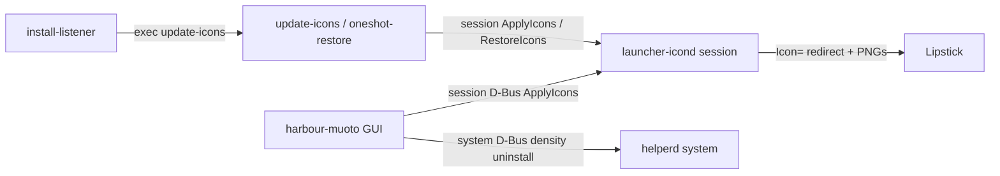

# Architecture

How Muoto theming works at runtime (3.2+). Pack-author layout is documented under [Icon pack guidelines](../icons); this page is the engine.

## Processes

| Process | Bus / unit | Role |
| ------- | ---------- | ---- |
| `harbour-muoto` | user GUI | Themes UI, Confirm, density; calls Helper / Launcher |
| `harbour-muoto-launcher-icond` | session `org.muoto.Launcher1` | All launcher icon apply/restore; `cap_dac_override` for system `.desktop` / silica folder writeback |
| `harbour-muoto-helperd` | system `org.muoto.Muoto1` | On-demand: `DensityEnable`, `UninstallPack` only |
| `harbour-muoto-install-listener` | user unit | D-Bus hooks → `/usr/bin/harbour-muoto-update-icons` |
| Boot / upgrade scripts | root systemd oneshots | Re-apply or pre-upgrade restore — see [Automation](automation) |

## Icon apply (launcher daemon)

1. GUI (or `update-icons`) sets dconf `activeIconPack` / `iconOverlay`, then calls session `org.muoto.Launcher1.Themes.ApplyIcons`.
2. `LauncherIconOps` rebuilds one `IconUpdater` per launcher `.desktop` (system + user APK desktops).
3. Pack assets come from `/usr/share/harbour-themepack-<name>/` (`jolla/`, `native/`, `apk/`). Overlay frames from `overlay/` composite onto stock when the pack has no matching icon.
4. Rendered PNGs land under `/usr/share/harbour-muoto/launcher-icons/`. Desktop `Icon=` is rewritten to that absolute path (**redirect**). Original `Icon=` is remembered in dconf `saved-id` and `launcher-manifest.json`.
5. Homescreen **folders** (`icon-launcher-folder-01`…`16`) use scoped silica writeback + `backup/folder-icons/`.
6. Dynamic clock/calendar use pack `dynclock/` / `dyncal/` (or stock SVG when pack is `default`) when dconf dyn flags are on.

Restore clears redirects via the manifest, restores folder backups, and sets `activeIconPack` to `default`.

**Not themed in 3.2+:** bulk silica ambient (`graphic-*`, status bar, etc.). Only launcher-relevant `icon-launcher-*` / native / APK paths.

## dconf (`/apps/harbour-muoto/`)

| Key | Purpose |
| --- | ------- |
| `activeIconPack` | Short pack name or `default` |
| `iconOverlay` | Style missing icons |
| `homeRefresh` | Restart Lipstick after apply (GUI) |
| `launcher/dynamicClockEnabled` | Live clock icon |
| `launcher/dynamicCalendarEnabled` | Live calendar icon |
| `launcher/applications/<desktop>/provider` | Only `dynamic-icon://…` is honored (clock/calendar) |
| `launcher/saved-id/<desktop>` | Original `Icon=` before redirect |

## Source map

| Area | Path |
| ---- | ---- |
| Apply / rebuild | `src/launcher/launchericonops.cpp` |
| Per-desktop update | `src/launcher/iconupdater.cpp`, `desktopentry.cpp` |
| Pack index | `src/launcher/harbourthemepack.cpp` |
| Overlay | `src/launcher/overlayiconprovider.cpp` |
| Manifest | `src/launcher/launchermanifest.cpp` |
| Daemon main | `src/launcher-daemon/main.cpp` |
| Confirm / themes UI | `qml/pages/ConfirmPage.qml`, `qml/components/ThemesTabContent.qml` |
| Dyn tab | `qml/components/DynamicIconsTabContent.qml` |
| Session D-Bus XML | `dbus/org.muoto.Launcher1.Themes.xml` |
| Shell helpers | `service/muoto-dbus-wait.sh`, `service/harbour-muoto-update-icons` |
