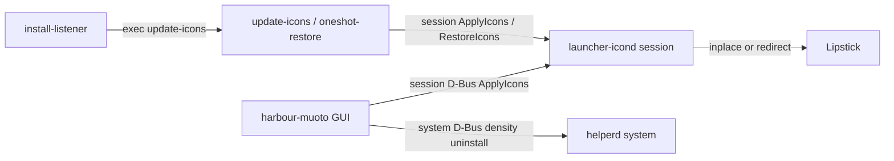

# Architecture

How Muoto theming works at runtime (3.2+). Pack-author layout is documented under [Icon pack guidelines](../icons); this page is the engine.

## Processes



| Process | Bus / unit | Role |
| ------- | ---------- | ---- |
| `harbour-muoto` | user GUI | Mosaic home, configure pages, density; calls Helper / Launcher |
| `harbour-muoto-launcher-icond` | session `org.muoto.Launcher1` | All launcher icon apply/restore; `cap_dac_override` for system `.desktop` / silica folder writeback |
| `harbour-muoto-helperd` | system `org.muoto.Muoto1` | On-demand: `DensityEnable`, `UninstallPack` only |
| `harbour-muoto-install-listener` | user unit | D-Bus hooks → `/usr/bin/harbour-muoto-update-icons` |
| Boot / upgrade scripts | root systemd oneshots | Re-apply or pre-upgrade restore — see [Automation](automation) |

## Icon apply (launcher daemon)

1. GUI (or `update-icons`) sets dconf `activeIconPack` / `iconOverlay`, then calls session `org.muoto.Launcher1.Themes.ApplyIcons`.
2. `LauncherIconOps` enqueues an `ApplyAll` job: re-arms Lipstick watches on known desktops (not clock/calendar, not brand-new names), rebuilds one `IconUpdater` per launcher `.desktop` (system + user APK desktops), then applies homescreen **folders** via `FolderAmbient`.
3. Pack assets come from `/usr/share/harbour-themepack-<name>/` (`jolla/`, `native/`, `apk/` — often symlinked to `~/.themepack/…`). Overlay frames from `overlay/` composite onto stock when the pack has no matching icon.
4. **Write model (hybrid):**
   - **Hicolor** (native / many overlay targets): **inplace** when the basename exists in exactly one hicolor size — keep `Icon=` as the theme name; replace that PNG (`N` ≥ `iconSizeLauncher` when upgrading from 86); `futimens` the `.desktop`. If other sizes or `scalable/` also ship the same basename, **redirect** instead (otherwise Lipstick may paint a stock sibling while we themed only one slot).
   - **APK bridge**: **redirect** — write `/usr/share/harbour-muoto/launcher-icons/<desktop>-<msecs>.png`, set `Icon=` to that path, touch the desktop (absolute paths need a new `Icon=` for Lipstick to refresh).
5. Original `Icon=` / paths are tracked in dconf `saved-id`, fingerprints (inplace), and `launcher-manifest.json`.
6. Homescreen **folders** (`icon-launcher-folder-01`…`16`) use scoped silica writeback + `backup/folder-icons/` (`FolderAmbient`).
7. Dynamic clock/calendar use pack `dynclock/` / `dyncal/` (or stock SVG when pack is `default`) when dconf dyn flags are on.

Restore uses the manifest (redirect + inplace backups), restores folder backups, clears generated `launcher-icons/`, and sets `activeIconPack` to `default`.

### Re-arming Lipstick's desktop watches

Lipstick's `LauncherMonitor` holds a per-file inotify watch on every `.desktop` it has discovered, and `LauncherModel` only re-reads an entry when that watch fires. apkd regenerates `apkd_launcher_*.desktop` with `rename(2)` whenever the Android container is rebuilt; native RPM updates do the same to existing names under `/usr/share/applications`. Qt drops the watch on the replaced inode, and `onDirectoryChanged` only calls `addPaths()` for filenames it has not seen before — so the watch is gone for good. From then on an `Icon=` rewrite is invisible and the tile needs a homescreen restart.

`LauncherWatch::rearmDesktopWatches` (`src/launcher/launcherwatch.cpp`) fixes this by renaming each entry to `<name>.muoto-rearm` and back:

- The two renames land in **separate** directory scans (400 ms apart), so Lipstick observes the name leaving and returning and calls `addPaths()` again.
- Both scans fall inside the 2000 ms `LAUNCHER_MONITOR_HOLDBACK_TIMEOUT_MS` window, so the pending remove and add cancel out — grid positions in `[LauncherOrder]` are untouched.
- Waits use `QTimer` continuations (no nested `QEventLoop`). `IconJobQueue` runs one icon job at a time so a dyn tick or second D-Bus call cannot nest inside re-arm.
- Callers wait out the remaining holdback before rewriting `Icon=`.

**Filter.** Re-arm never includes `jolla-clock` or `jolla-calendar` (dyn ticks use inplace + `futimens` only). It also skips filenames unseen since the last rebuild (`s_knownDesktops`) — Lipstick already watches those, and renaming them during the holdback was the two-app grid shuffle. Apply / restore / APK refresh re-arm the rest (including first Apply from `pack=default`, when most apps have no updater yet). `rebuildIconUpdatersNow()` and shutdown (`prepareShutdown`) sweep leftover `*.muoto-rearm` files.

### Recovering after an Android container restart

When Android support restarts, apkd rewrites `apkd_launcher_*.desktop` and resets `Icon=` to the stock bridge path, so the APK tiles need re-theming. `AlienDalvikWatcher` (`src/launcher/aliendalvikwatcher.cpp`) listens for apkd's `containerReady` property going true — the standard `org.freedesktop.DBus.Properties.PropertiesChanged` on session-bus path `/com/jolla/apkd`, subscribed with no sender filter because apkd takes a new bus name each restart.

`LauncherIconOps` enqueues a `RefreshApk` job that re-arms filtered APK desktops and recreates only the APK `IconUpdater`s. It deliberately skips the folder pass, the native entries and `pruneOrphans` (which takes the full desktop list and would drop every native entry), so a container restart costs a couple of seconds rather than a full `ApplyIcons`.

Measured on device, apkd rewrites the desktops around 9 s into the restart and announces `containerReady` at about 26 s — but it then syncs them **again** roughly 5 s later, which wipes the first refresh. Hence the one-shot verification pass 15 s after a refresh: if an APK entry that has an updater no longer carries one of our generated `Icon=` paths, the refresh runs once more. Journal for a healthy recovery:

```
apkd containerReady
re-armed launcher watches for 15 desktop entries
refreshApkIcons pack= "..." desktops= 15 themed= 15
APK icons clobbered after refresh, retrying
re-armed launcher watches for 15 desktop entries
refreshApkIcons pack= "..." desktops= 15 themed= 15
```

Note apkd only rewrites the entries when their content differs from its canonical form, so a device with no pack applied sees no churn at all.

### New apps and app updates

A pack already applied should pick up a newly installed or updated launcher without the user opening Muoto.

**Listener.** `harbour-muoto-install-listener` tracks PackageKit transactions on the system bus. Relevant roles (canonical `PkRoleEnum`, measured on SFOS 5.1 / PackageKit 1.2.5):

| Role | Meaning | Who uses it |
| ---- | ------- | ----------- |
| 10 | `InstallFiles` | `pkcon install-local`, Storeman installing a downloaded RPM |
| 11 | `InstallPackages` | `pkcon install` from a repo |
| 22 | `UpdatePackages` | Storeman install *and* update |
| 33 | `UpgradeSystem` | OS-image upgrades (usually blocked by the update guard) |

The `Package` signal is `(u info, s package_id, s summary)` — info `11` updating / `12` installing is a fallback if the role query misses. APK apps use session `com.jolla.apkd` `appInstalled` / `appUpdated`. A hit execs `/usr/bin/harbour-muoto-update-icons`, which calls session `ApplyIcons`.

`activeIconPack` stores the full package name (`harbour-themepack-xenlism-wildfire`). The script must strip that prefix before testing `/usr/share/harbour-themepack-$short` — prepending it a second time makes every apply a silent no-op.

**Daemon watch.** Role constants have been wrong before, so `LauncherIconOps` also watches `/usr/share/applications` and `~/.local/share/applications`. After a 3 s trailing debounce (each `directoryChanged` restarts the timer), a `RefreshDesktops` job (same lock / pack / upgrade guards as APK refresh) attaches an `IconUpdater` for every non-`NoDisplay` desktop that has none, and recreates inplace updaters whose PNG no longer matches the stored fingerprint. Re-arm only paths already in `s_knownDesktops` (never clock/calendar, never names unseen since the last full rebuild). A pending `ApplyIcons` from the listener drops a pending desktop refresh so the new app is not folded into known before Apply's re-arm. Our own writes call `storeFingerprint`, so the wake-up they cause is a no-op. Journal for a healthy native install:

```
tracking PK transaction "..." role= 11 roleRelevant= true
refreshNewDesktops pack= "..." pending= 1 themed= 1
scheduled apply, trigger packagekit
update-icons: attempt 1 ApplyIcons pack=... overlay=true
ApplyIcons done ok=true
```

**Not themed in 3.2+:** bulk silica ambient (`graphic-*`, status bar, etc.). Only launcher-relevant `icon-launcher-*` / native / APK paths.

## dconf (`/apps/harbour-muoto/`)

| Key | Purpose |
| --- | ------- |
| `activeIconPack` | Short pack name or `default` |
| `iconOverlay` | Style missing icons |
| `homeRefresh` | Restart Lipstick after apply (GUI) |
| `launcher/dynamicClockEnabled` | Live clock icon |
| `launcher/dynamicCalendarEnabled` | Live calendar icon |
| `launcher/applications/<desktop>/provider` | Only `dynamic-icon://…` is honored (clock/calendar) |
| `launcher/saved-id/<desktop>` | Original `Icon=` before redirect (and related restore state) |
| `launcher/fingerprint/<hash>` | Inplace “our bytes” marker for hicolor paths |

## Source map

| Area | Path |
| ---- | ---- |
| Apply / rebuild | `src/launcher/launchericonops.cpp` |
| Job queue | `src/launcher/iconjobqueue.cpp` |
| Install / update re-theme | `src/listener/installlistener.cpp`, `src/listener/pktxwatch.cpp` |
| Per-desktop update | `src/launcher/iconupdater.cpp`, `desktopentry.cpp` |
| Pack index | `src/launcher/harbourthemepack.cpp` |
| Path resolve (hicolor / APK) | `src/launcher/iconresolve.cpp` |
| Lipstick watch re-arm | `src/launcher/launcherwatch.cpp` |
| apkd container readiness | `src/launcher/aliendalvikwatcher.cpp` |
| Overlay | `src/launcher/overlayiconprovider.cpp`, `overlayrender.cpp` |
| Folder silica | `src/launcher/folderambient.cpp` |
| Manifest | `src/launcher/launchermanifest.cpp` |
| Daemon main | `src/launcher-daemon/main.cpp` |
| Font apply / restore | `src/gui/fontapplier.cpp` (stages under `~/.local/share/fonts/muoto/`) |
| Mosaic home / theme work | `qml/pages/MainPage.qml`, `qml/components/ThemeWork.qml` |
| Icons / fonts configure | `qml/pages/IconsConfigurePage.qml`, `qml/pages/FontsConfigurePage.qml` |
| Dyn icons | `qml/pages/DynamicIconsPage.qml` |
| Session D-Bus XML | `dbus/org.muoto.Launcher1.Themes.xml` |
| Shell helpers | `service/muoto-dbus-wait.sh`, `service/harbour-muoto-update-icons` |
